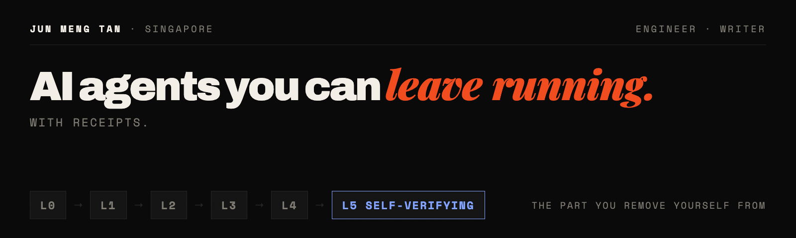
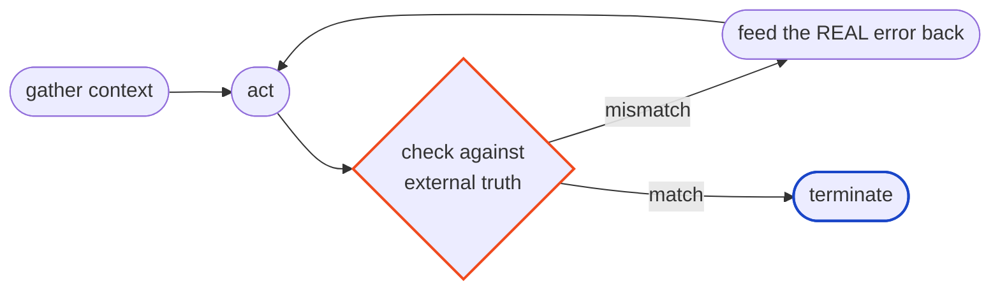

<picture>
  <source media="(prefers-color-scheme: dark)" srcset="banner-dark.png">
  <source media="(prefers-color-scheme: light)" srcset="banner-light.png">
  
</picture>

I build AI agents reliable enough to leave running, and I write about how to get there.

Production engineer at **Ant International** (Alipay/Ant Group), ex-PayPal. I ship systems
where mistakes cost real money, which happens to be the bar an agent has to clear before
you can walk away from it.

---

### The ladder

Six levels of using AI. Each one is defined by a single thing: **the part of the work you
remove yourself from.** Most people sit two levels lower than they think, because the
tooling hides it.

|    | Level | What it means | Who checks the work |
|:--:|:------|:--------------|:--------------------|
| `L0` | Chat as a tool | You ask, it answers, you copy things out by hand | you |
| `L1` | Persistent context | Standing instructions and files it always sees | you |
| `L2` | Skills | Know-how in modules, loaded only when the task needs them | you |
| `L3` | Scheduled agents | Runs on a timer or an event, without you present | you |
| `L4` | Multi-agent orchestration | One agent coordinates several. Usually overkill | still you |
| `L5` | **Self-verifying systems** | Checks its own work against real ground truth, fails safe | **the environment** |

Read the last column downward. That is the whole ladder.

---

### The loop underneath all of it

An agent grading its own work is just the model agreeing with itself. The same weights
that produced the error are now marking it. So the check comes from somewhere the agent
cannot argue with: a test that passes or fails, a schema it validates against, a total
that matches a known number.

The evaluator is the environment, not the agent.

---

### What I write about

- Why agents fail silently, and the external checks that catch them
- Skills, scheduled agents and orchestration: what they cost, and when **not** to use them
- Teardowns of real systems, mine included: the loop, where it broke, what fixed it
- The honest economics — most orchestration is over-engineering

**Twice a week on [LinkedIn](https://www.linkedin.com/in/tanjunmeng/).**

---

Native English + Mandarin · Singapore · Personal views, educational only. If I get
something wrong, tell me and I'll fix it and credit you.
